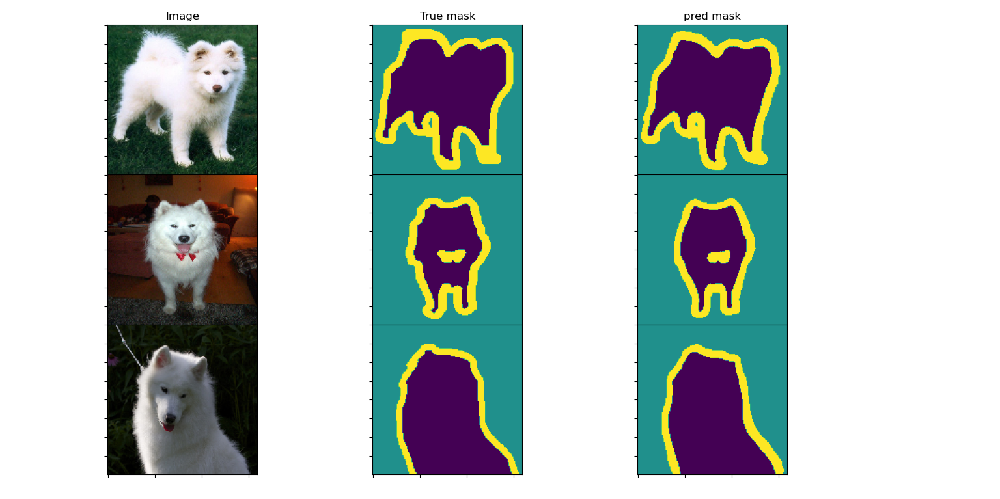

# oxfordpet-seg

Keras implementation of various Net and comparision of performance on [Oxford-Pet](https://www.robots.ox.ac.uk/~vgg/data/pets/)  dataset.

## Samples results:

## Files

- [``dataloader.py``](https://github.com/AvishekParajuli/oxfordpet-seg/blob/main/data_loader.py): Contains data loading, preprocessing and augumentations
- [``train_unet2.py``](https://github.com/AvishekParajuli/oxfordpet-seg/blob/master/train_unet2.py): Main script file used for training model.
- [``predict_unet2.py``](https://github.com/AvishekParajuli/oxfordpet-seg/blob/master/predict_unet2.py): Main script file for predicting from the saved model
- [``model.py``](https://github.com/AvishekParajuli/oxfordpet-seg/blob/master/model.py): Actual implementation of Unet or possible other models.
